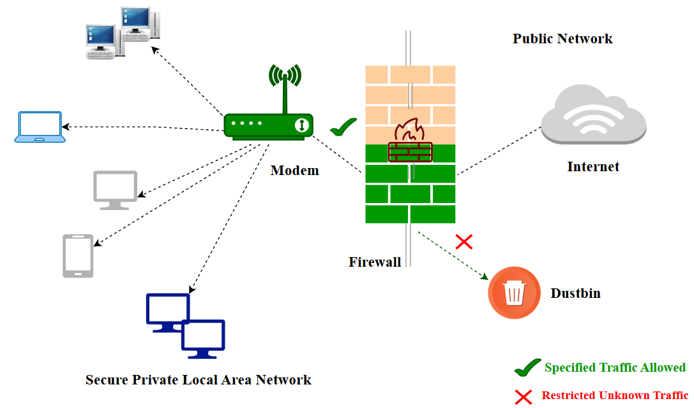

# Firewall

A firewall is a network security device designed to monitor, filter, and control incoming and outgoing network traffic based on predetermined security rules. The primary purpose of a firewall is to establish a barrier between a trusted internal network and untrusted external networks.

  

   
  

## ⭐Firewall Functions: Network Address Translation (NAT) and Virtual Private Network (VPN) ⭐

NAT changes the destination or source addresses of data packets as they pass through a firewall. This allows multiple devices to connect to the internet using the same IP address, which helps protect the private network from direct exposure to external threats. A VPN is a type of proxy server. Therefore, It serves as a barrier between a computer or network and the internet, receiving all web requests before forwarding them to the network.

## Types of Firewalls

1. Application-Level Gateways (Proxy Firewalls)- Application-Level Gateways are the types of firewalls that function at the application layer between two end systems. Unlike basic firewalls, it captures and analyzes packets in the application layer according to the OSI model.

2. Circuit-Level Gateways- Circuit-Level Gateways are the types of firewalls that can be easily configured, have low resource consumption, and have a simplified structure. These types of firewalls verify TCP connections and sessions and operate in the session layer of the OSI model.

3. Cloud Firewalls- Cloud Firewalls are the types of firewalls used when the institution receives firewall service over the cloud as a service. Another name is "FWaaS" (firewall-as-a-service). There are some advantages to using a cloud firewall. For example, cloud firewalls have no physical resources, which means they can be easily reconfigured based on demand or traffic load. Additional capacity can be added to accommodate increased traffic.

4. Endpoint Firewalls- Endpoint Firewalls are the types of host-based firewalls installed on devices. It is a type of firewall that is often difficult to manage. It is an important component that must be used to ensure security. For example, the "Windows Defender Firewall", which comes pre-installed in Windows, is an example of this type of firewall.

5. Network Address Translation (NAT) Firewalls- Network Address Translation (NAT) Firewalls are the types of firewalls designed to access internet traffic and block unwanted connections. Such firewalls hide the IP addresses in the internal network from the external network. In other words, it is the firewall where NAT is applied.

6. Next-Generation Firewalls (NGFW)- Next-Generation Firewalls (NGFW) is a type of firewall that combines the features of different firewalls available under the conditions of that day on a single firewall. These firewalls have a deep-packet inspection (DPI) feature. This type of firewall is designed to block external threats, malware attacks, and advanced attack methods.

7. Packet-Filtering Firewalls- Packet-Filtering Firewalls are the most basic type of firewall. It monitors network traffic and filters incoming packets according to configured rules. A Packet-Filtering firewall blocks the destination port if the incoming packet does not match the rule set. This firewall is one of the quick solutions that can be used without any resource requirements. But there are also some disadvantages. For example, it lacks the ability to block web-based attacks.

8. Stateful Multi-Layer Inspection (SMLI) Firewalls- A Stateful Multi-Layer Inspection (SMLI) Firewall is a type of firewall capable of both packet inspection and TCP handshake verification. With these features, it stands out from other firewalls. It also has the feature of tracking the status of established connections.

9. Threat-Focused NGFW- Threat-Focused NGFW has all the features of an NGFW-type firewall. In addition, it has advanced threat detection features. Thanks to this feature, it can react quickly to attacks. It helps to provide security more effectively thanks to the rules written with a threat focus. Since it monitors every malicious activity from beginning to end, it runs the process faster by shortening the time from the first time it detects the threat to the cleaning phase.

10. Unified Threat Management (UTM) Firewalls- Unified Threat Management (UTM) Firewalls are a special type of stateful inspection firewalls with antivirus and intrusion prevention.

Some popular Firewall products used in the cybersecurity industry are as follows:

- Fortinet
- Palo Alto Networks
- SonicWall
- Checkpoint
- Juniper
- pfsense
