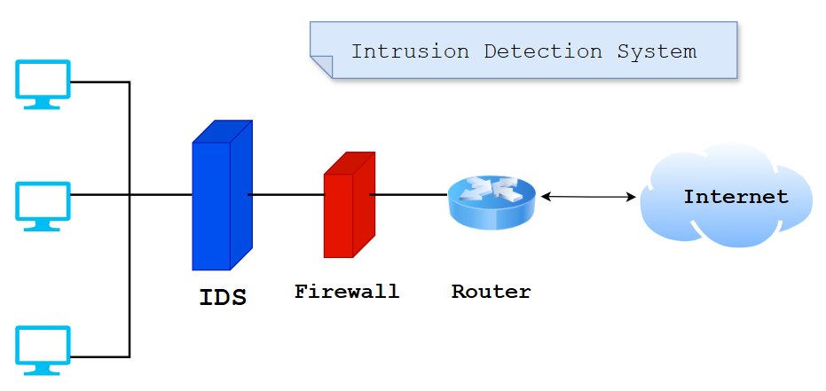

# Intrusion Detection System (IDS)

### An Intrusion Detection System (IDS) is a network security tool that monitors network traffic and devices for known malicious activity, suspicious activity or security policy violations. IDSs can be software applications that are installed on endpoints or dedicated hardware devices that are connected to the network.

  

   
  

## Why Are Intrusion Detection Systems (IDS) Important?
An intrusion detection system provides an extra layer of protection, making it a critical element of an effective cybersecurity strategy. You can use it alongside your other cybersecurity tools to catch threats that can penetrate your primary defenses. So even if your main system fails, you are still alerted to the presence of a threat. A healthcare organization, for example, can deploy an IDS to signal to the IT team that a range of threats have infiltrated its network, including those that have managed to bypass its firewalls. In this way, the IDS helps the organization stay compliant with data security regulations.

`Some popular IDS products used in the cybersecurity industry are as follows:`

- Zeek/Bro
- Snort
- Suricata
- Fail2Ban

## Types of IDS
1. Network Intrusion Detection System (NIDS)- A Network Intrusion Detection System (NIDS) is used to detect whether there is traffic suitable for attacker behavior by passing all traffic on the network through it. When abnormal behavior is observed in the traffic, an alert can be generated and the administrator can be informed.

2. Host Intrusion Detection System (HIDS)- The Host Intrusion Detection System (HIDS) works on a specific host in the network. It tries to detect malicious activities by examining all network packets coming to this device and all network packets going from this device. Detected malicious behaviors are reported to the administrator as an alert.

3. Protocol-Based Intrusion Detection System (PIDS)- A Protocol-Based Intrusion Detection System (PIDS) is a type of IDS that examines the traffic between a server and a client in a protocol-specific way.

4. Application Protocol-based Intrusion Detection System (APIDS)- An Application Protocol-Based Intrusion Detection System (APIDS) is a type of IDS that tries to detect security breaches by monitoring communication in application-specific protocols.

5. Hybrid Intrusion Detection System- A Hybrid Intrusion Detection System is a type of IDS in which two or more violation detection approaches are used together.
