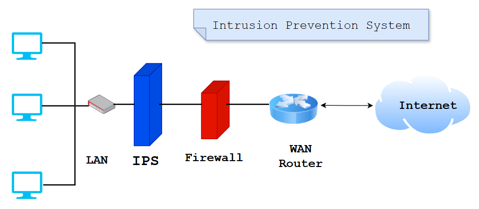

# Intrusion Prevention System (IPS)
An Intrusion Prevention System (IPS) monitors network traffic for potential threats and automatically blocks them by alerting the security team, terminating dangerous connections, removing malicious content, or triggering other security devices. It is more advanced than an intrusion detection system (IDS), which simply detects malicious activity but cannot take action against it beyond alerting an administrator. 

  

   
  

## Types of intrusion prevention Systems

1. Network Intrusion Prevention System (NIPS): This type of IPS is installed only at strategic points to monitor all network traffic and proactively scan for threats.

2. Host Intrusion Prevention System (HIPS): In contrast to an NIPS, an HIPS is installed on an endpoint (such as a PC) and looks at inbound and outbound traffic from that machine only. It works best in combination with a NIPS, as it serves as a last line of defense for threats that have made it past the NIPS.

3. Network Behavior Analysis (NBA): This analyzes network traffic to detect unusual traffic flows, such as DDoS (Distributed Denial of Service) attacks.

4. Wireless Intrusion Prevention System (WIPS): This type of IPS simply scans a Wi-Fi network for unauthorized access and kicks unauthorized devices off the network.

